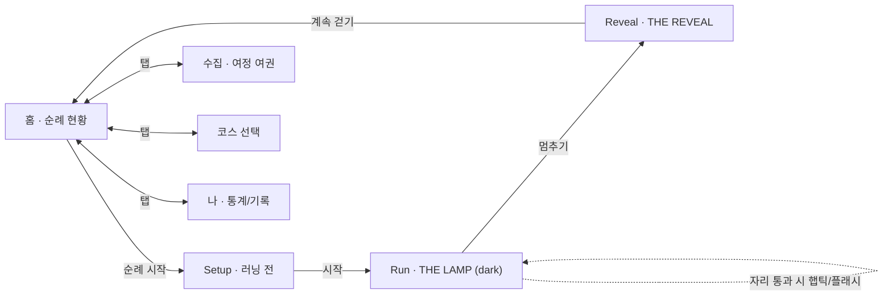
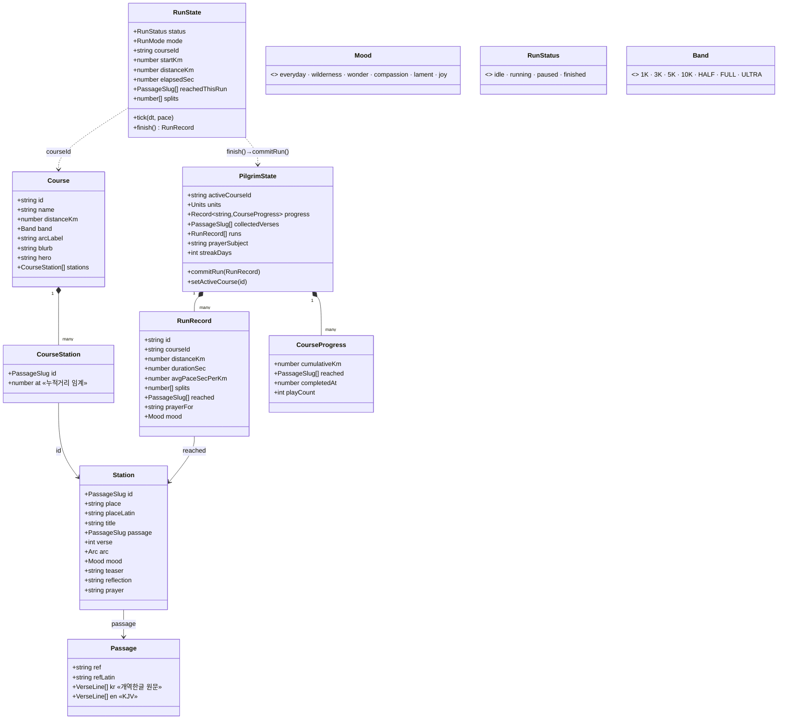
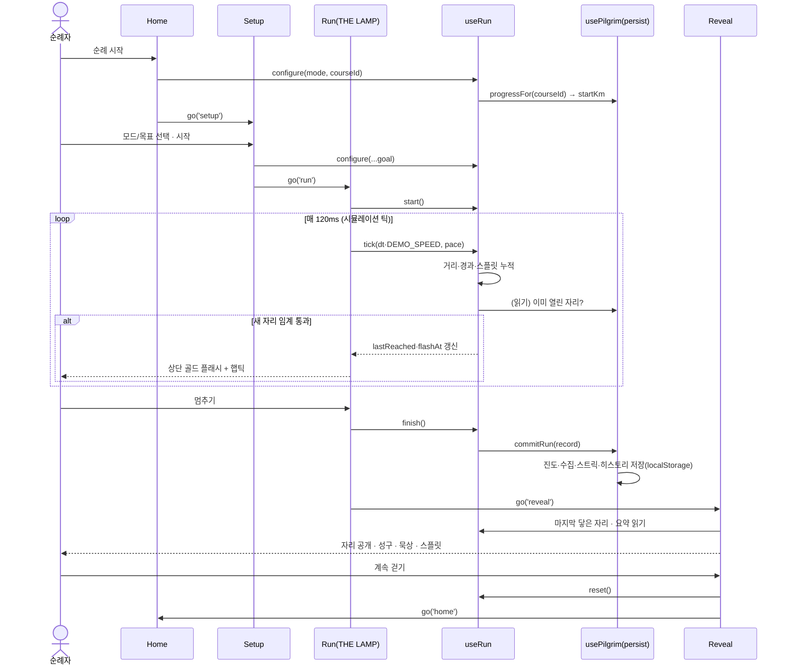
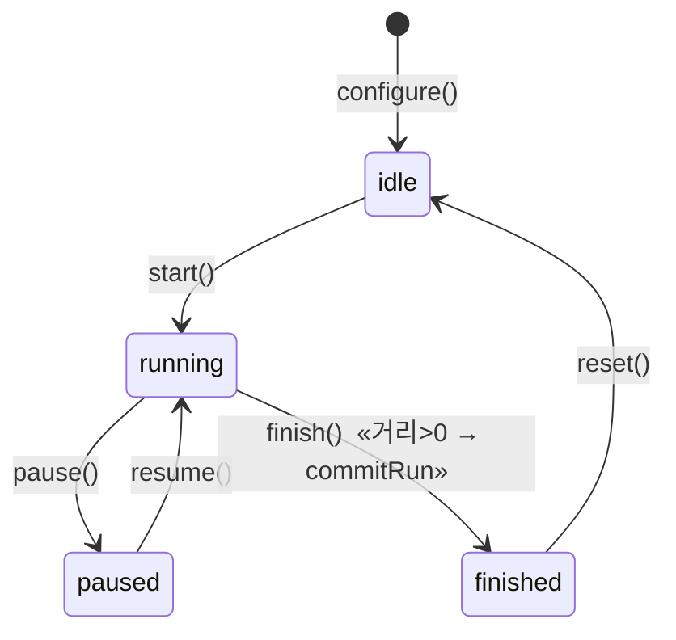
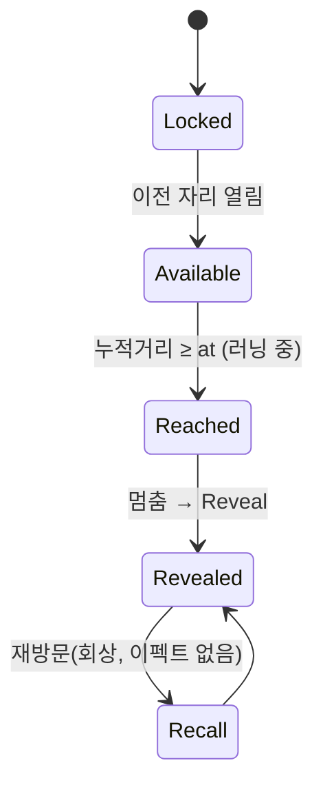
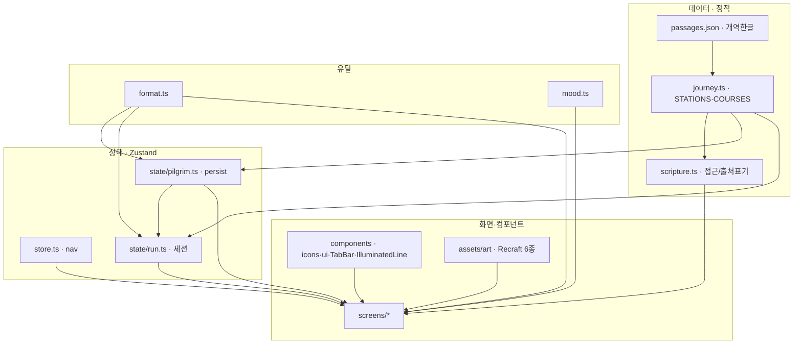

# THE WAY — 아키텍처 & 다이어그램 (S1 구현 기준)

> 이 문서는 **실제 구현된 코드(S1)**를 반영한다. 개념·기획은 PLANNING/DESIGN-* 문서, 데이터 원칙은 CONTENT-UX/ART-DIRECTION 참조.
> 스택: React 19 · Vite 6 · Tailwind v4 · Zustand(+persist) · PWA. 모든 상태는 **로컬 우선**(개인 GPS·기도 원본은 서버로 나가지 않음).

---

## 1. 한눈에 보기

**핵심 서사**: 달린 거리만큼 예수님의 사역 여정(세례 → 갈릴리 → 예루살렘 → 부활 → 땅 끝)이 이어진다. 복음서 사건 = **자리(Station)**. 거리별 **순례길(Course)**을 걸으며 누적거리가 자리를 연다.

**코어 루프(3화면)** + **확장 화면(4)**:



---

## 2. 클래스 다이어그램 (도메인 + 상태)



**핵심 설계 결정**
- **성경(Passage) ↔ 묵상(Station.reflection/prayer) 분리**: 성경은 개역한글 원문(수정 금지·출처표기), 묵상은 창작(저작권 무관). 저작권/검수를 독립적으로 다룬다.
- **거리 임계(`CourseStation.at`)로 자리 해금** — 누적거리가 넘으면 열림. `progressOf(course, km)`가 판정.
- **`Station.mood`가 톤을 구동** — `lib/mood.ts`가 색·글로우·`celebrate`/`gamified` on-off 공급. `lament`는 축하 UI를 신학적으로 차단.

---

## 3. 유즈케이스 다이어그램

```mermaid
flowchart LR
  P((순례자))
  subgraph 여정
    UC1([코스 선택])
    UC2([순례 시작 · 모드/목표 설정])
    UC3([러닝 · 거리·페이스 기록])
    UC4([자리에 닿다 · 해금])
    UC5([리빌 · 성구/묵상])
    UC6([구절 수집])
  end
  subgraph 기도·기록
    UC7([오늘 품고 달릴 사람 설정])
    UC8([호흡 기도])
    UC9([순례 기록 열람])
    UC10([여정 여권 열람])
    UC11([단위·초기화 설정])
    UC12([공유 카드])
  end
  P --- UC1 & UC2 & UC3 & UC5 & UC7 & UC9 & UC10 & UC11 & UC12
  UC3 -.include.-> UC4
  UC3 -.include.-> UC8
  UC4 -.extend.-> UC5
  UC5 -.include.-> UC6
```

---

## 4. 시퀀스 — 순례 러닝 한 바퀴



## 5. 시퀀스 — 자리 해금 판정 (`useRun.tick`)

```mermaid
sequenceDiagram
  participant Tick as tick(dt, pace)
  participant J as journey.progressOf
  participant Pilgrim as usePilgrim
  Tick->>Tick: distanceKm += dt/pace ; cumulative = startKm + distanceKm
  Tick->>Pilgrim: reached(courseId) 조회
  Tick->>J: course.stations 순회
  loop 각 자리
    alt cumulative ≥ at AND 아직 안 열림
      Tick->>Tick: reachedThisRun.push(id) · lastReached=id · flashAt=elapsed
      Tick->>Tick: navigator.vibrate([40,60,120])
    end
  end
```

---

## 6. 상태 머신

**러닝 세션** (`useRun.status`)


**자리(Episode) 진행**


---

## 7. 모듈 아키텍처



---

## 8. 로드맵 / 플랜

| 단계 | 범위 | 상태 |
|---|---|---|
| **S1 (완료)** | 데이터 구동 코어: 코스/자리·영속 스토어·7화면·커스텀 아이콘·Recraft 아트·시뮬 러닝 | ✅ |
| **S2** | 실 GPS 연동(geolocation → `tick` 대체), 실내/러닝머신 보정, 백그라운드 트래킹 | ☐ |
| **S3** | 공유 카드 실동작(캔버스 PNG export, 프라이버시 트리밍), 온보딩("첫 순례") | ☐ |
| **S4** | 절기 시즌 챌린지(사순절 인터페이스 금식·부활절 리빌), 복음서별 관점 보기 | ☐ |
| **S5** | 공동 여정(교회/소그룹 합산 — 추상 색실만 전송), 중보 응원 | ☐ |
| **착수 전** | 브랜드명 상표조사 · 개역개정 라이선스 · 신학 검수위 · (완료)디자인 API 키 | ☐ |

**S1에서 검증 완료**: `tsc --noEmit` + `vite build`(55 모듈, PWA precache). 브라우저 육안 검증은 별도.

**데이터 원칙(불변)**: 개역한글 원문 수정 금지·출처표기(`성경전서 개역한글판 · ⓒ 대한성서공회`). 인물=얼굴 없는 실루엣·1세기 고증. `lament`=축하 UI 차단.
