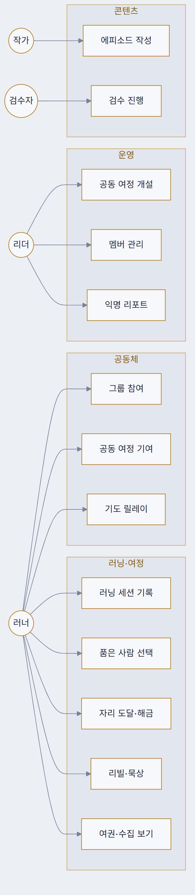
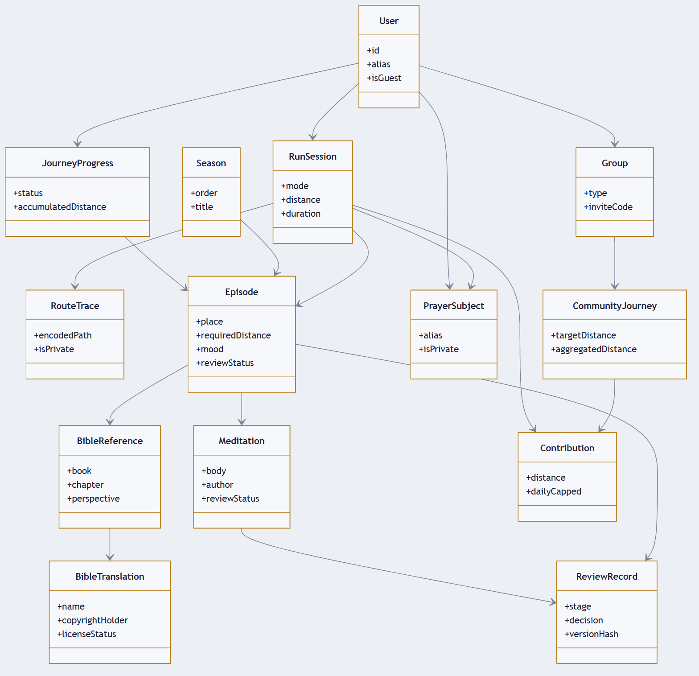
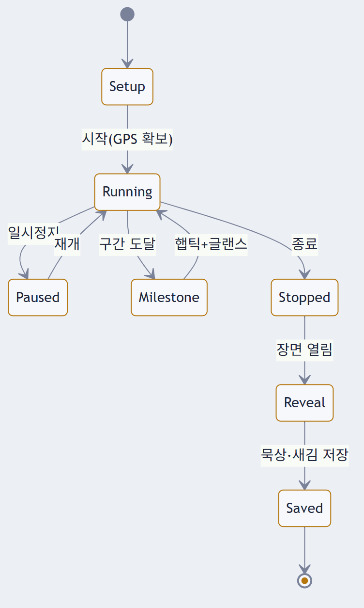
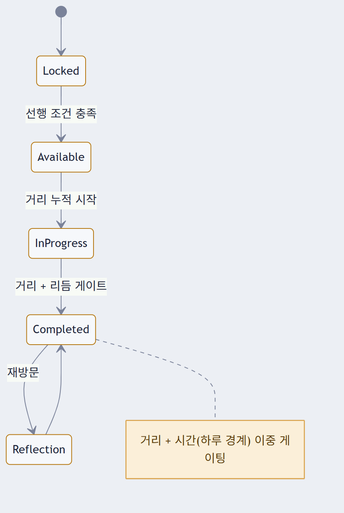
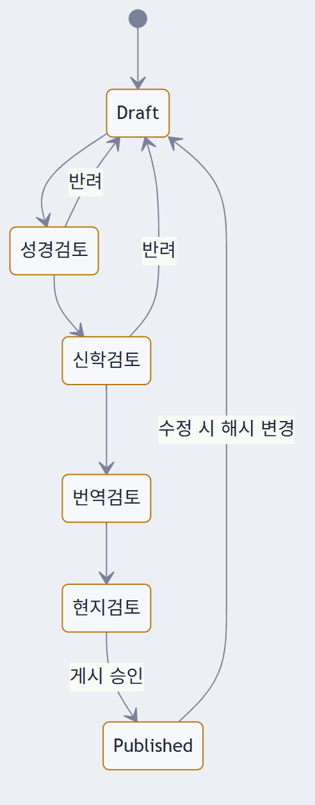
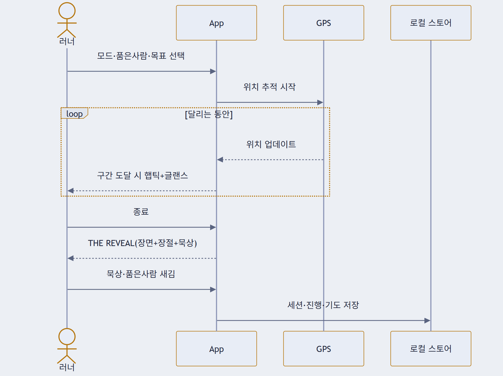
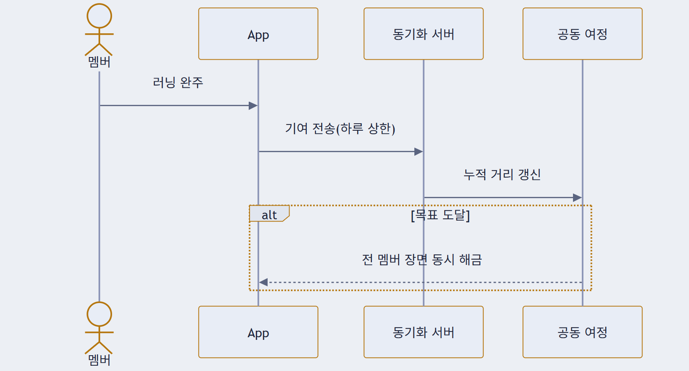
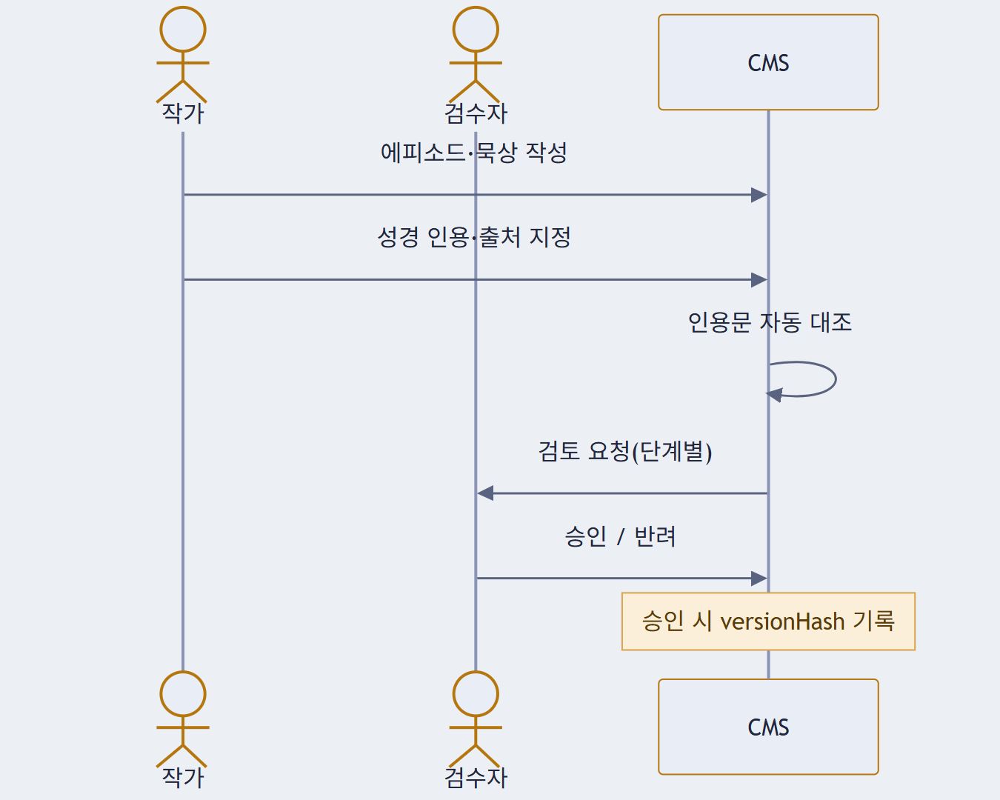
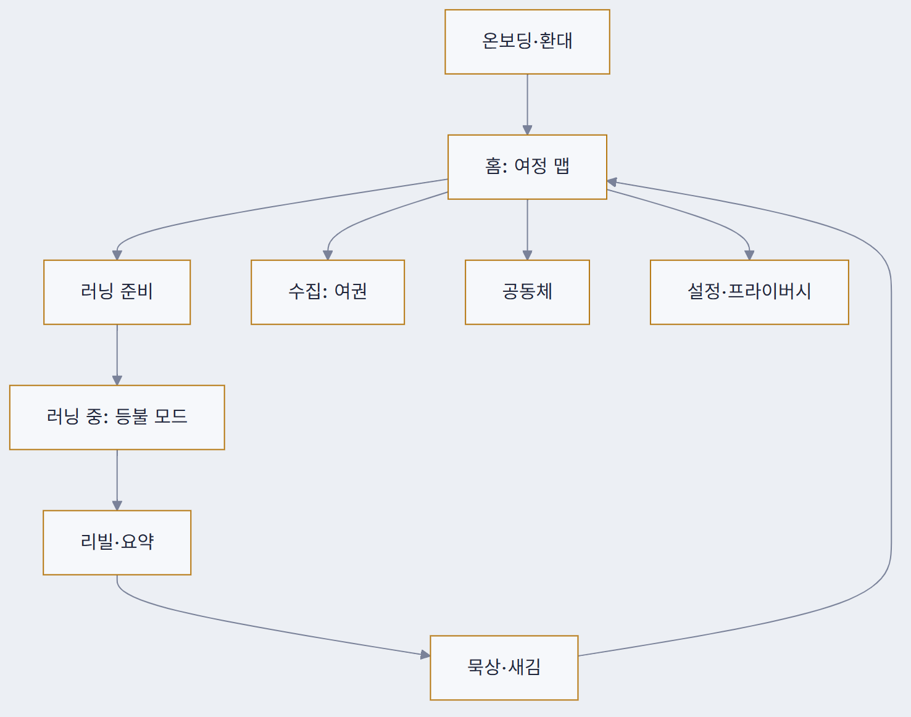
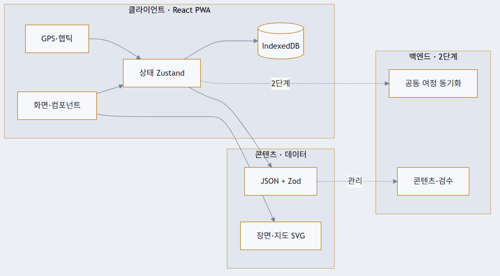

<h1 align="center">THE WAY · 설계 다이어그램</h1>

<em>디지털 순례길 러닝 앱의 소프트웨어 설계 도면 — 실제 렌더된 PNG 10장</em>

  <code>docs/ENGINEERING.md</code>의 설계를 렌더한 뷰 · 심야 등불 청사진 스타일 · 2026-07-21

---

## 프로세스 모델

**진화적 프로토타이핑 + 애자일 반복.** 워터폴·전면 나선형은 부적합(나선형의 "위험 먼저"만 차용). 최대 불확실성이 자료구조가 아니라 "이 경험이 통하나"이므로, 그걸 먼저 값싼 프로토타입으로 검증하고 설계는 병행한다.

`S0` 시그니처 프로토타입 → `S1` 러닝 코어 → `S2` 여정·수집 → `S3` 공동체 → `S4` 콘텐츠·검수

---

## 01 · 유즈케이스

액터 4(러너 = 신자·구도자 공통 / 그룹·교회 리더 / 콘텐츠 작가 / 신학 검수자)와 기능. 러닝·여정은 MVP, 공동체·운영은 이후 단계.

---

## 02 · 도메인 모델 (클래스)

가장 중요한 도면. **핵심 결정 세 가지** — ① 성경(`BibleReference`) ↔ 묵상(`Meditation`) **분리**(저작권·검수 독립) ② `ReviewRecord.versionHash`로 수정 시 승인 자동 무효 ③ `Episode.mood`로 콘텐츠별 톤 프리셋 구동. (필드는 대표만 표기)

---

## 03 · 상태 — 러닝 세션 수명주기

장면(Reveal)은 **멈춰야만** 열린다 — 달리며 화면을 보지 않게 하는 안전 설계.

---

## 04 · 상태 — 에피소드 진행

“복음서는 폭식하지 않는다.” 거리뿐 아니라 **시간(하루 경계)**으로도 게이팅.

---

## 05 · 상태 — 콘텐츠 검수 워크플로

작성 → 성경 → 신학 → 번역 → 현지 → 게시. 게시 후 **한 글자만 수정해도** versionHash가 바뀌어 승인 자동 무효.

---

## 06 · 시퀀스 — 개인 러닝 세션

Gospel Journey 모드. 로컬 우선(IndexedDB) — 개인 GPS 원본은 서버로 나가지 않는다.

---

## 07 · 시퀀스 — 교회 공동 여정 기여

하루 상한으로 장거리 러너 독점 방지. 개인 GPS가 아니라 **추상 색실**만 합산·동기화.

---

## 08 · 시퀀스 — 콘텐츠 검수

인용문은 본문 DB와 자동 대조(오탈자·절 오기 차단). 승인 순간 versionHash 기록.

---

## 09 · 정보구조 (화면 맵)

온보딩 → 홈 → 러닝 → 리빌 → 묵상 → 수집(수직 흐름). 공동체는 이후 분기.

---

## 10 · 아키텍처 개요

1단계는 백엔드 최소/무(無) — 로컬 우선(IndexedDB), 콘텐츠는 정적 JSON+SVG. 2단계부터 동기화 서버.

---

다이어그램 소스: <code>docs/ENGINEERING.md</code>(Mermaid) · 톤 프리셋: <code>docs/CONTENT-UX.md</code>

