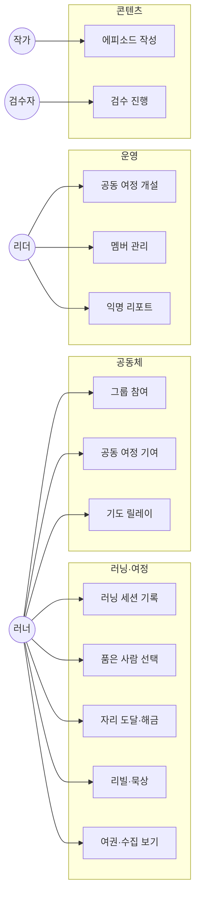
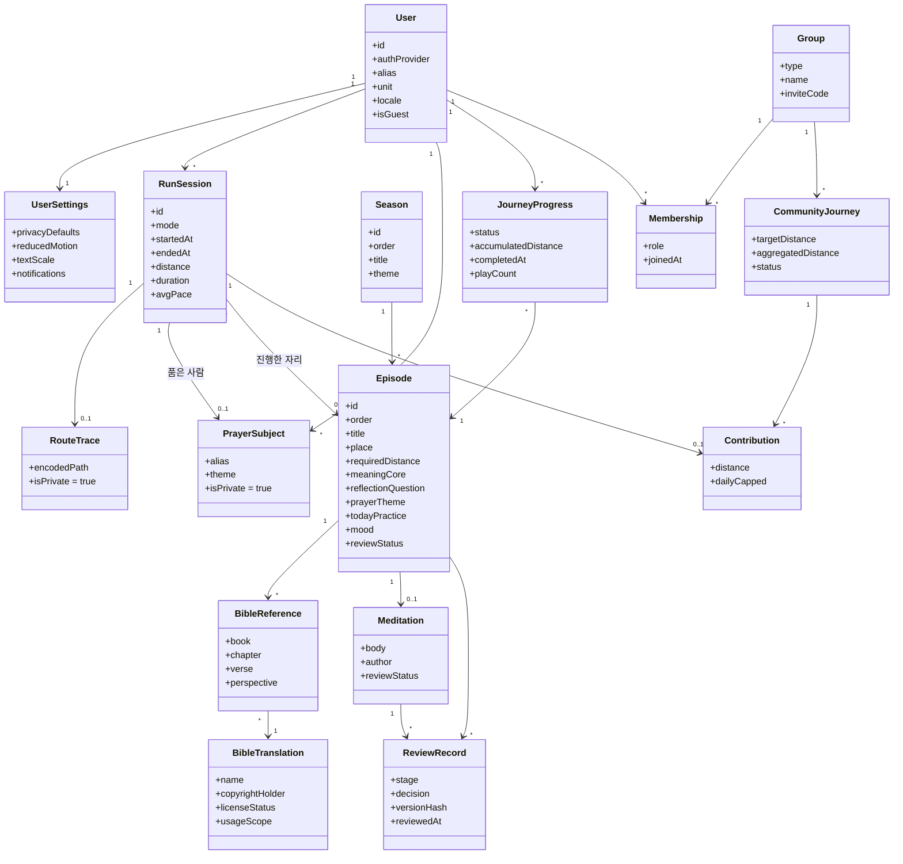
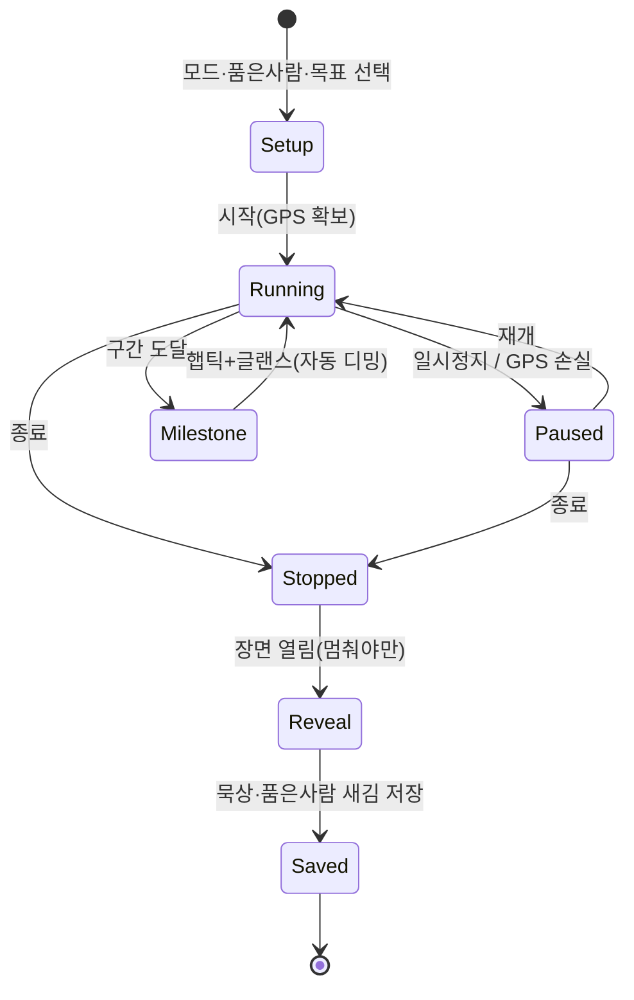
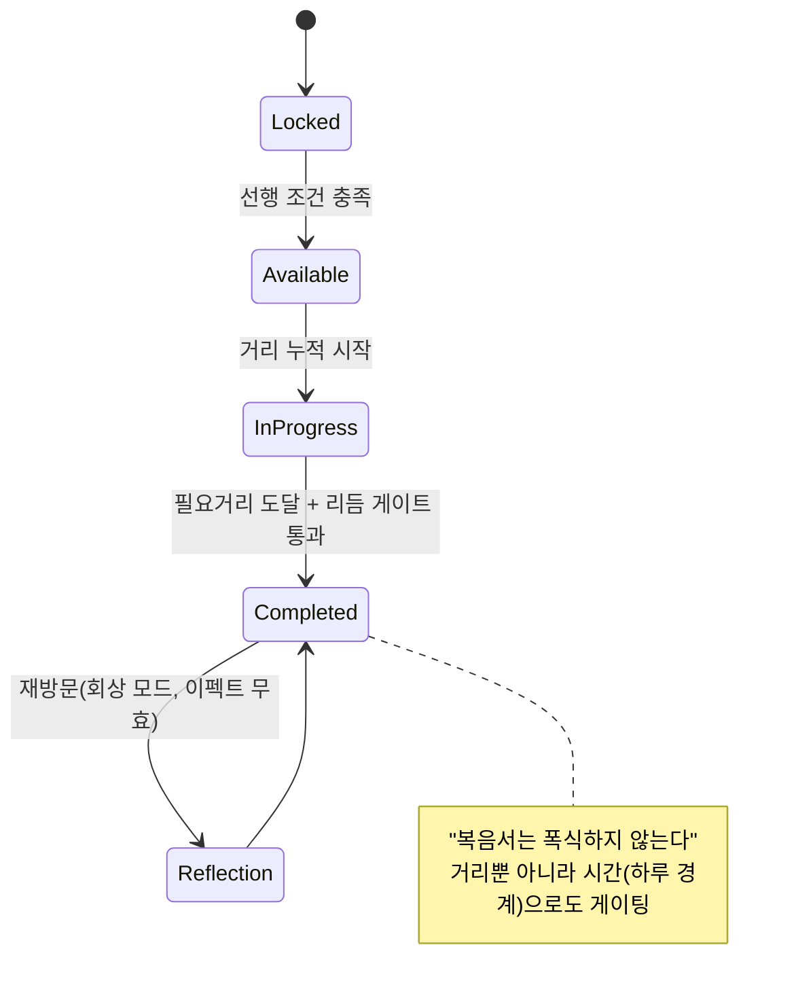
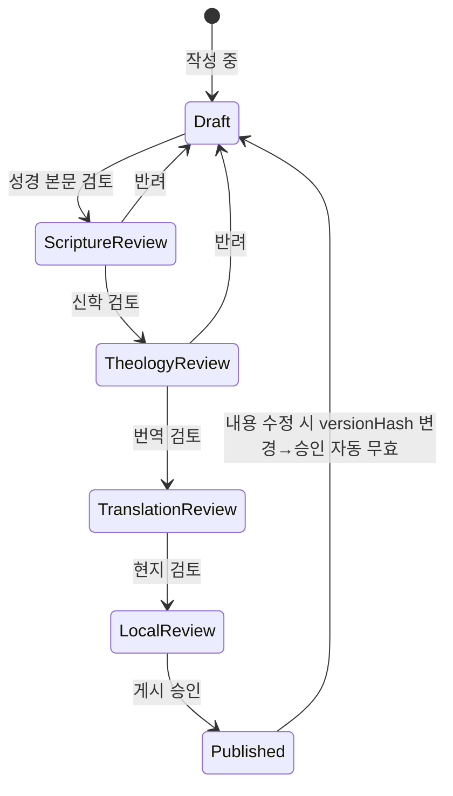
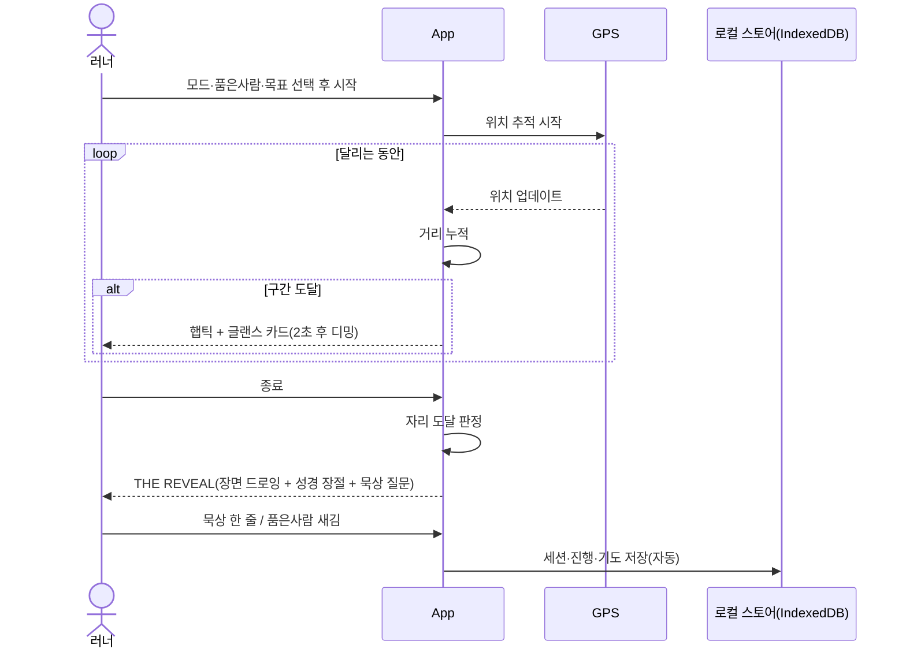
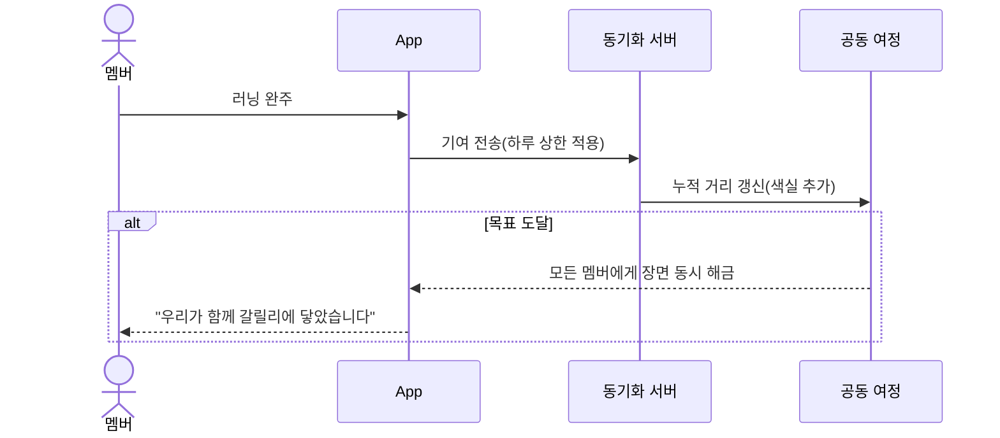
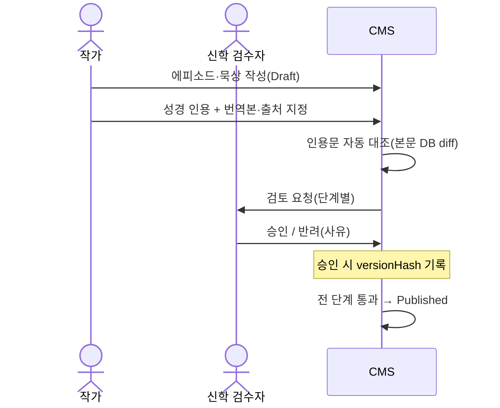
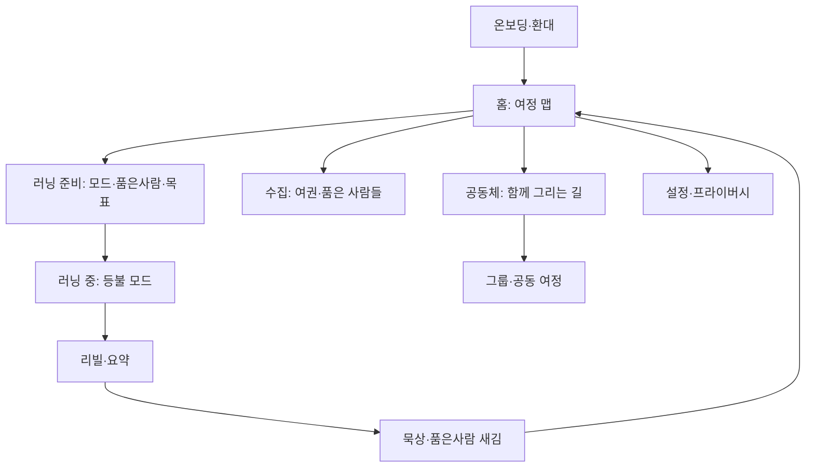
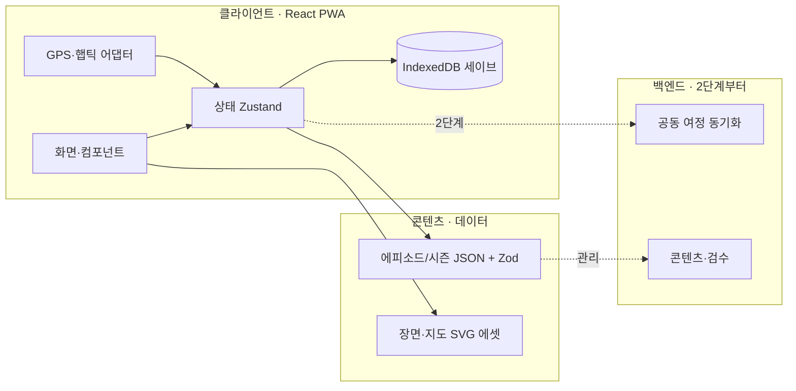

# 소프트웨어 공학 설계 — PROJECT THE WAY

> 2026-07-21 · 개발 착수 전 SE 설계. 기획 문서([[PLANNING]], [[BRAINSTORM]], [[GROWTH]])는 **폐기하지 않는다** — 이 문서는 그 기획을 구현 가능한 구조로 번역한 것이다.
> 다이어그램은 Mermaid(깃허브에서 바로 렌더). 렌더된 PNG 모음은 [`docs/DIAGRAMS.md`](DIAGRAMS.md) 참조.

**이 문서의 판단 원칙:** 1인/소규모 + 경험 중심 제품이다. 가치 높은 SE 산출물은 제대로 하고, 대기업 워터폴식 과잉 문서는 뺀다. 각 절 끝에 "지금 하는 것 / 나중 / 안 하는 것"을 명시한다.

---

## 1. 프로세스 모델 — 무엇을 채택하나

### 결론: **진화적 프로토타이핑 + 애자일 반복(Kanban/Scrum-lite)**

| 모델 | 이 프로젝트에 맞나 | 이유 |
|---|---|---|
| **워터폴** | ❌ | 요구사항이 고정 아님. "이게 재밌나/감동되나"는 만들어 봐야 안다. 한 방향 단선 진행은 경험 중심 제품에 부적합. |
| **나선형(Spiral)** | △ 부분 차용 | 매 주기 형식적 위험분석은 1인 팀엔 과함. 단, **"위험 먼저"** 정신은 빌린다 → 착수 전 3대 현실 리스크(브랜드명·성경 저작권·검수위원회)를 선(先)처리. |
| **프로토타입 모델** | ✅ 코어 | 핵심 리스크("시그니처 경험이 통하나")를 값싼 프로토타입으로 먼저 검증. THE LINE + THE REVEAL 프로토타입이 바로 이것. |
| **애자일 반복** | ✅ 코어 | 짧은 반복으로 러닝 루프를 조금씩 붙여 실제로 뛰어보며 조정. 1인 팀엔 경량 Kanban. |

### 왜 "프로토타입 먼저"가 SE를 건너뛰는 게 아닌가
프로토타입 모델은 정식 SE 프로세스다. "가장 불확실한 부분을 실행 가능한 산출물로 먼저 만들어 검증한다"가 그 정의다. 우리의 최대 불확실성은 **자료구조나 API가 아니라 "이 경험이 사람을 움직이나"** 이므로, 그걸 먼저 프로토타입한다. 데이터/아키텍처 설계(아래 3~6절)는 그와 **병행**한다.

### 반복 계획 (스프린트 백로그 씨앗)
- **S0 — 시그니처 프로토타입:** THE LINE 드로잉 + THE REVEAL(가짜 데이터, 자체완결 HTML/컴포넌트). 검증 질문: "감동/프리미엄이 오나?"
- **S1 — 러닝 코어:** 실제 GPS → 거리 → 마일스톤 햅틱/글랜스 → 정지 → 리빌 → 저장. (에피소드 1개)
- **S2 — 여정·수집:** 여정 맵(시즌/자리) + 품은 사람 새김 + 여권.
- **S3 — 공동체:** 그룹/초대코드 + 공동 여정(색실) + 격려/릴레이.
- **S4 — 콘텐츠·검수 파이프라인:** 콘텐츠 관리 + 검수 상태 워크플로.

---

## 2. 유즈케이스 — 액터와 기능

### 액터
- **러너(개인 사용자)** — 신자 / 구도자(무신론자) 공통. 게스트로도 시작 가능.
- **그룹·교회 리더(운영자)** — 공동 여정·기도 주제 개설, 멤버 관리(단, 개인 경로·신앙 상태 열람 불가).
- **콘텐츠 작가** — 에피소드·묵상 작성.
- **신학 검수자** — 예장통합 목회자/신약학자 등. 콘텐츠 승인 게이트.
- **시스템(백그라운드)** — GPS 추적, 햅틱, 알림, 진행 판정.

### 유즈케이스 맵

**지금:** 러닝·여정(UC1–5) MVP 핵심. **나중:** 공동체·운영(UC6–11)은 2단계. **안 함:** 결제·랭킹 유즈케이스.

---

## 3. 도메인 모델 — 클래스 다이어그램

> 이게 가장 값진 산출물이다. 기획서 §11이 "데이터 구조를 초반에 확정, 나중에 바꾸면 비쌈"이라 명시했다. 성경 본문 ↔ 자체 묵상 **분리**, 검수 상태를 **버전 해시**에 묶는 것이 핵심.

**핵심 설계 결정**
- **성경(BibleReference/BibleTranslation) ↔ 묵상(Meditation) 분리** — 저작권·검수 독립. 번역본별 저작권자/허가상태를 데이터로 추적.
- **ReviewRecord.versionHash** — 콘텐츠 한 글자만 바뀌어도 해시가 달라져 승인 자동 무효화. 검수는 1회 이벤트가 아니라 상설 게이트(BRAINSTORM 신학 원칙).
- **RouteTrace.isPrivate 기본 true**, PrayerSubject.isPrivate 기본 true — 기획서 §11 보수적 기본값.
- **Contribution.dailyCapped** — 하루 기여 상한(장거리 러너 독점 방지).
- **Episode.mood** — 콘텐츠별 톤 프리셋 6종 enum(everyday·wilderness·wonder·compassion·lament·joy). `ToneProvider`가 읽어 팔레트·모션·mechanic on/off 적용. `mood==='lament'`이면 축하·배지·거리 UI를 끄도록 Zod refine으로 강제(십자가 비-게임화). 상세: [[CONTENT-UX]].

**지금:** User~JourneyProgress~PrayerSubject 구현. **나중:** Group~Contribution(2단계). **안 함:** 결제/구독 엔티티.

---

## 4. 상태 다이어그램

### 4-1. 러닝 세션 수명주기

### 4-2. 에피소드 진행(JourneyProgress) — 거리 + 리듬(시간) 이중 게이팅

### 4-3. 콘텐츠 검수 워크플로 (기획서 §15)

---

## 5. 시퀀스 다이어그램 (핵심 플로우만)

### 5-1. 개인 러닝 세션 (Gospel Journey)

### 5-2. 교회 공동 여정 기여

### 5-3. 콘텐츠 검수

---

## 6. 정보구조(IA) / 화면 맵

**지금:** 온보딩→홈→러닝→리빌→묵상→수집(수직 흐름). **나중:** 공동체 분기. **안 함:** 상점·랭킹 화면.

---

## 7. CRM / 관리자 구조 — 범위 정리

**질문:** CRM 구조를 하나? → **고전적 영업 CRM은 지금 안 한다.** 이 제품의 "관계 관리"는 세 갈래이고, 대부분 2단계 이후다.

| 층 | 무엇 | 시점 |
|---|---|---|
| **사용자 계정 관리** | 가입·게스트·설정·탈퇴 시 데이터 삭제 | MVP(1단계) |
| **커뮤니티 관리** | 그룹/교회 초대코드, 멤버, **익명 집계만**(개인 경로·신앙 상태 열람 불가) | 2단계 |
| **콘텐츠 관리(CMS)** | 에피소드·묵상 작성/검수 워크플로(4-3, 5-3) | MVP에 관리자용 최소판 |
| **교회 파트너 관계(진짜 CRM 성격)** | 교회 온보딩·파트너십 관리 | 3단계(글로벌 확장) |

**핵심 제약:** 운영자 대시보드는 **익명 통계만**. 개인 신앙 지표는 애초에 존재하지 않는다(기획서 §11 — 감시 금지). 이건 신학이자 안전.

---

## 8. 아키텍처 개요 (경량)

- **1단계는 백엔드 최소/무(無):** 로컬 우선(IndexedDB), 콘텐츠는 정적 JSON+SVG. PWA로 오프라인·설치형.
- **2단계부터 동기화 서버** — 공동 여정 합산·릴레이. 개인 GPS 원본은 서버로 안 보냄(추상 색실만).

---

## 9. 지금 안 하는 SE 산출물 (의도적 생략)

과잉 문서는 1인 팀 속도를 죽인다. 다음은 **필요해질 때** 만든다.
- 전 화면 상세 와이어프레임 명세서 → 프로토타입으로 대체, 필요 화면만.
- 모든 플로우의 시퀀스 다이어그램 → 핵심 3개만(5절). 나머지는 코드가 문서.
- 상세 배포/운영 런북, 부하 테스트 계획 → 사용자 생기면.
- 형식적 요구사항 추적 매트릭스 → 백로그(이슈)로 갈음.

---

## 요약

- **프로세스:** 진화적 프로토타이핑 + 애자일. 워터폴/전면 나선형은 부적합, 나선형의 "위험 먼저"만 차용(3대 현실 게이트 선처리).
- **기획은 유지·발전** — 이 문서가 그 증거. 기획→구현 번역.
- **최우선 SE 산출물 = 도메인 모델(3절)** — 성경/묵상 분리, 검수-버전해시 결합, 프라이버시 기본값.
- **CRM = 지금은 계정+CMS 최소판, 커뮤니티/교회 파트너는 2~3단계.**
- 다음 실행: S0 시그니처 프로토타입(THE LINE + THE REVEAL)과 도메인 타입 정의를 병행.
