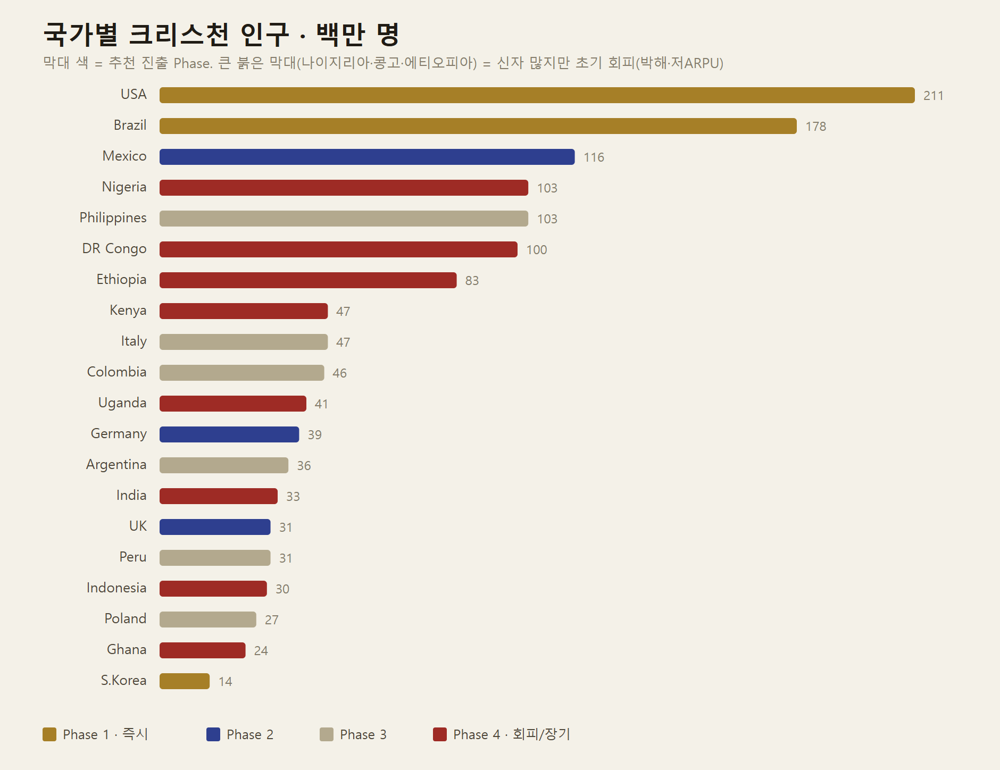
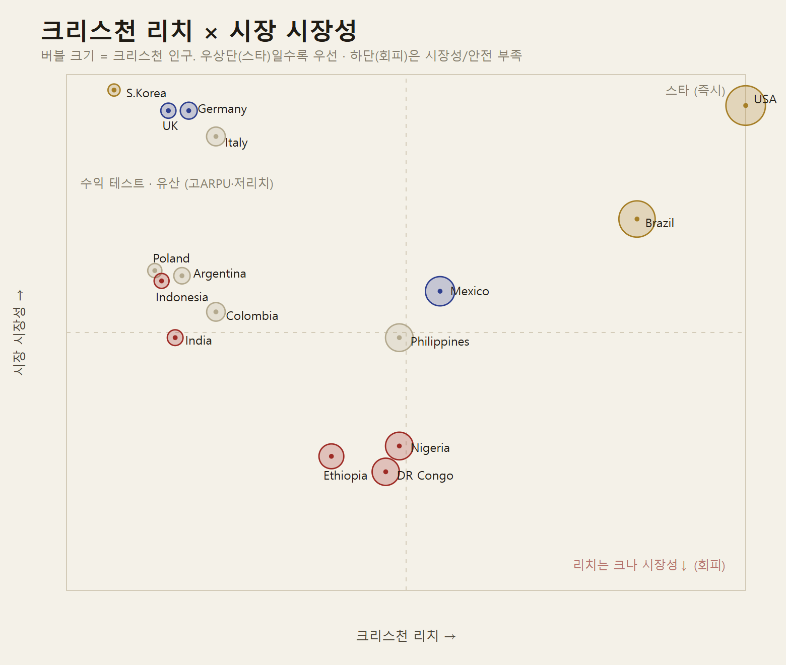

# 글로벌 시장 전략 — PROJECT THE WAY

> 2026-07-21 · **데이터 기반 국가 우선순위.** 어느 나라를, 어떤 순서로, 왜.
> 기술·현지화 실행은 [[PLANNING]] §10 참조. 신학은 [[gospel-game-doctrine]] 원칙.
> 데이터 출처는 문서 끝 §11. 인구는 최신 추정치(백만 명 반올림) — 착수 전 재검증 필요.

---

## 0. 결론 먼저 (TL;DR)

**Phase 1 = 미국 · 한국 · 브라질 세 나라 동시 코어.** 각자 다른 역할을 맡는 삼각 구조다.

| 나라 | 역할 | 한 줄 이유 |
|---|---|---|
| 🇺🇸 **미국** | **앵커 (Anchor)** | 세계 최대 크리스천 시장 + 러닝 문화 + 앱 지출 1위 + 영어. 성장 천장이 가장 높다. |
| 🇰🇷 **한국** | **홈베이스 · 프리미엄 검증** | 시장은 작아도 시장성 최상. 예장통합 신학 검수 근거지 · 제품/톤/루프 검증 최적지 · 고ARPU 결제 테스트. |
| 🇧🇷 **브라질** | **리치 엔진 (Reach)** | 1.8억 크리스천 · 열정적 신앙 · 러닝 붐. 규모로 사용자 기반을 만든다. |

> **왜 하나가 아니라 셋인가:** 미국은 *수익·영어 성장*, 브라질은 *대규모 신자 리치*, 한국은 *검증·홈베이스*. 어느 하나도 셋을 겸하지 못한다. 리치(Brazil) · 수익(US) · 검증(Korea)을 각각 최적 국가에 배치하는 것이 핵심.

Phase 2는 **멕시코·독일·영국**, Phase 3는 **필리핀·이탈리아·콜롬비아·아르헨티나·페루·폴란드**. 신자 수가 아무리 커도 **초기 회피**하는 나라는 §6.

---

## 1. 스코어링 프레임

국가 우선순위 = **크리스천 리치 × 시장 시장성**. 신자 수 하나로 줄 세우지 않는다.

- **크리스천 리치 (X축)** — 크리스천 인구 규모 + 신앙 활성도(주간 예배 참석·자기정체성). "얼마나 많은 잠재 사용자가 이 앱을 *원할* 것인가."
- **시장 시장성 (Y축)** — 스마트폰 보급·성능 · 러닝/피트니스 문화 · 앱 결제력(ARPU) · 데이터·연결성 · 성경 번역 라이선스 접근성 · **사용자 안전(박해·규제)**. "얼마나 *실행 가능*하고 *안전*한가."
- **버블 크기** — 크리스천 인구(백만). 큰 버블이 낮은 곳에 있으면 = *신자는 많지만 지금 들어가면 안 되는* 시장.

두 축을 곱해 사분면에 놓으면, "신자 많은 나라 = 좋은 시장"이라는 착각이 깨진다.

---

## 2. 국가별 크리스천 인구 — 규모만 보면 오판한다

미국·브라질이 압도적 1·2위(2.1억 / 1.8억)인 건 예상대로다. **주목할 건 붉은 막대다.** 나이지리아(1.0억)·DR콩고(1.0억)·에티오피아(0.83억)는 신자 수로는 세계 5·6·7위권이지만 **초기 회피 대상**이다 — 저ARPU, 저사양 안드로이드, 불안정한 데이터·GPS, 일부는 박해/안전 위험(§6).

반대로 **한국(0.14억)은 막대가 가장 짧지만 Phase 1**이다(금색). 규모가 아니라 *시장성·검증 가치*로 뽑혔다. 규모 축 하나로는 이 결정을 설명할 수 없다 — 그래서 두 번째 축이 필요하다.

---

## 3. 리치 × 시장성 — 전략은 사분면에서 보인다

- **우상단 = 스타 (즉시 진출).** 리치·시장성 모두 높음. **미국**이 유일하게 코너를 차지(211M·리치 100·시장성 94). **브라질**은 우측(리치 84)·시장성 72로 스타에 근접 — Phase 1의 리치 엔진.
- **좌상단 = 수익 테스트 · 유산 시장 (고ARPU·저리치).** **한국·독일·영국·이탈리아.** 신자 리치는 작거나 세속화됐지만 결제력·인프라 최상. 한국을 여기서 홈베이스로, 독·영은 Phase 2에서 *0층 러닝앱 온램프*([[GROWTH]])로 세속화에 대응.
- **중앙 = 균형.** **멕시코**(리치 55·시장성 58, 1.16억) — Phase 2 라틴 진입점. **필리핀**(경계선, 1.03억) — 영어·모바일 최강이나 ARPU 낮아 Phase 3.
- **하단 = 회피.** **나이지리아·DR콩고·에티오피아**가 큰 버블로 바닥에 몰려 있음 = 리치는 크나 시장성·안전 부족. **인도**(리치 낮음·다수종교·개종 민감)도 여기.

---

## 4. 종합 랭킹 & Phase 배정

| 순위 | 나라 | 크리스천(M) | 리치 | 시장성 | Phase | 핵심 근거 |
|---:|---|---:|---:|---:|:--:|---|
| 1 | 🇺🇸 미국 | 211 | 100 | 94 | **1** | 앵커. 최대 시장·러닝 문화·앱 지출 1위·영어 |
| 2 | 🇧🇷 브라질 | 178 | 84 | 72 | **1** | 리치 엔진. 열정적 신앙·러닝 붐·큰 성장 천장 |
| 3 | 🇰🇷 한국 | 14 | 7 | 97 | **1** | 홈베이스·신학 검수·제품 검증·고ARPU 테스트 |
| 4 | 🇲🇽 멕시코 | 116 | 55 | 58 | 2 | 스페인어 라틴 관문·스마트폰 급성장 |
| 5 | 🇩🇪 독일 | 39 | 18 | 93 | 2 | 고ARPU·인프라 최상·세속화 온램프 검증 |
| 6 | 🇬🇧 영국 | 31 | 15 | 93 | 2 | 영어 유럽 교두보·앱 지출 높음 |
| 7 | 🇵🇭 필리핀 | 103 | 49 | 49 | 3 | 영어·모바일/소셜 세계 최고, 단 ARPU 낮음 |
| 8 | 🇮🇹 이탈리아 | 47 | 22 | 88 | 3 | 가톨릭 유산·인프라 좋음·전례 감수 필요 |
| 9 | 🇨🇴 콜롬비아 | 46 | 22 | 54 | 3 | 스페인어 확장·오순절 강세 |
| 10 | 🇦🇷 아르헨티나 | 36 | 17 | 61 | 3 | 스페인어 남미·도시 러닝 문화 |
| 11 | 🇵🇪 페루 | 31 | — | — | 3 | 스페인어 커버리지 확장 |
| 12 | 🇵🇱 폴란드 | 27 | 13 | 62 | 3 | 유럽 최고 신앙 활성·가톨릭 |
| — | 🇳🇬 나이지리아 | 103 | 49 | 28 | **4·회피** | 대규모 신자, 그러나 저ARPU·저사양·안전 위험 |
| — | 🇨🇩 DR콩고 | 100 | 47 | 23 | **4·회피** | 인프라·연결성·안정성 최하위권 |
| — | 🇪🇹 에티오피아 | 83 | 39 | 26 | **4·회피** | 정교 신학 별도 트랙·연결성·안전 |
| — | 🇮🇳 인도 | 33 | 16 | 49 | **4·신중** | 다수종교 사회·개종 관련 법/안전 민감 |
| — | 🇮🇩 인도네시아 | 30 | 14 | 60 | **4·신중** | 크리스천 소수·종교 민감도 |

*(리치·시장성은 0–100 상대 점수. 페루는 스페인어 묶음 확장 대상으로 개별 점수 생략.)*

---

## 5. Phase별 로드맵

### Phase 1 — 코어 3국 동시 (Launch)
- **미국(앵커) · 한국(검증) · 브라질(리치).** 언어: **영어 · 한국어 · 포르투갈어.**
- 한국에서 제품·톤·루프·신학을 확정 → 미국에서 성장·수익, 브라질에서 리치를 검증.
- 성경 라이선스 선확보 3언어: 한국어(대한성서공회 등) · 영어 · 포르투갈어.

### Phase 2 — 고시장성 + 라틴 관문 (6–12개월)
- **멕시코**(스페인어) — 스페인어 자산으로 라틴 전역의 교두보. **독일·영국** — 고ARPU·세속화 온램프 검증(0층 러닝앱 전략).
- 스페인어 하나로 콜롬비아·아르헨티나·페루까지 사정권.

### Phase 3 — 스페인어권 + 영어 SEA + 가톨릭 유럽 (12–24개월)
- **필리핀**(영어·모바일 최강, 저비용 진출) · **이탈리아·폴란드**(가톨릭 전례 감수) · **콜롬비아·아르헨티나·페루**(스페인어 규모 확장).

### Phase 4 — 장기·신중 (인프라/안전 성숙 후)
- **영어권 아프리카(나이지리아·케냐·가나·우간다)** — 오프라인·저데이터·저사양 최적화 + 안전 모드가 준비된 뒤에만.
- **정교회권(에티오피아·동유럽·러시아)** — 별도 신학 트랙. **인도·인도네시아** — 안전·법률 실사 후 신중 진입.

---

## 6. 회피·신중 리스트 (신자 많아도 지금은 아님)

> "크리스천이 많다 ≠ 지금 들어간다." 이 목록이 이번 분석의 핵심 산출물이다.

- **나이지리아 · DR콩고 · 에티오피아 (신자 83–103M).** 규모는 세계급이지만 **시장성 23–28**. 저ARPU로 수익 모델 부재, 저가 안드로이드·저데이터·불안정 GPS로 코어 경험(정확한 러닝 트래킹) 자체가 흔들림. 지역에 따라 **박해·치안 위험** → 위치+기도제목(민감정보) 노출이 사용자를 위험에 빠뜨릴 수 있음. **초기 진출 시 브랜드·신뢰·안전 리스크가 이득을 초과.**
- **인도 · 인도네시아.** 크리스천이 인구 소수 + **개종 관련 법·사회 민감도**가 높아 안전·법률 실사가 선행돼야 함.
- **중국.** 대규모 지하·가정 교회지만 규제·검열·앱 배포 제약으로 별도 전략 영역(현 로드맵 밖).

**원칙: 사용자 안전 > 성장.** 진출하더라도 저노출 모드·위치 은닉 강화·기도제목 기본 비공개가 선행 조건([[PLANNING]] §11).

---

## 7. 시장별 실행 변수 (진출 전 체크)

| 변수 | 왜 중요 | 대응 |
|---|---|---|
| **성경 번역 라이선스** | 언어마다 저작권자 다름(한국=대한성서공회 등). **가장 큰 병목** | 언어별 사용 허가 선확보, 본문/묵상 데이터 분리([[PLANNING]] §10.3) |
| **교단 지형** | 가톨릭·개신교·정교·오순절 신학·전례 차이 | 지역별 감수위원, 사도신경·니케아신경 공통 기반 |
| **연결성·데이터 비용** | 아프리카·SEA 저데이터 | 오프라인 우선(PWA), 저데이터 모드, 지도 없는 루트 |
| **기기 성능** | 저가 안드로이드 다수 | 경량 번들, 저사양 60fps, 애니메이션 절제 |
| **결제·PPP** | 소득 격차 큼 | 핵심 무료 필수, 지역별 가격(PPP), 교회 라이선스 |
| **문화·이미지** | 인종·복식·성상 표현 | 얼굴 없는 실루엣 기본, 현지 문화 검토([[PLANNING]] §10.4) |
| **단위·형식** | km/mi, 날짜·시간대 | 지역 자동 + 수동 선택 |
| **박해 위험** | 위치+기도제목=민감 | 안전 모드, 위치 은닉 강화, 저노출 옵션, 필요 시 미출시 |

---

## 8. 현지화 깊이 (번역 그 이상)

- **신학 감수 = 지역별.** 번역만으로 부족 — 교단 용어·기도 표현·전례를 현지 목회자/신학자가 검수([[PLANNING]] §10.4, §15).
- **성경 번역본 = 언어별 라이선스.** 시장 진입 게이트.
- **전례력 차이** — 가톨릭/개신교/정교 절기 다름. [[CONTENT-UX]] 톤·절기 시스템을 지역별로.
- **RTL 준비** — 아랍어권(장기) 대비 구조.

---

## 9. 신학·안전 스탠스 (글로벌)

- 화면 전면엔 **정통 기독교 공통 언어**(사도신경·니케아신경). 지역별 엄밀 검수는 뒤에서.
- **비신자 온램프**(0층 좋은 러닝앱 → 스스로 층 상승)는 세속화된 유럽·다종교 사회에서 특히 유효([[GROWTH]]).
- **박해 지역 최우선 아님.** 안전이 성장보다 우선.

---

## 10. 시장별 KPI

- 시장별 분리 집계: 가입→첫 러닝 완료율, 7·30일 리텐션, 러닝→리빌 도달, 언어별 사용률, 저데이터·저사양 비율, 위치·기도 안전 사고 0.
- [[GROWTH]]의 "몸으로 갔는가"(교회·이웃 실천) 지표 병행.

---

## 11. 데이터 출처 · 방법 주석

- **크리스천 인구:** Pew Research Center 글로벌 기독교 인구 추정 + World Christian Database 계열 국가 수치(백만 반올림).
- **시장성 구성 지표:** 스마트폰 보급·성능(GSMA 계열), 앱 결제력(app ARPU 국가 벤치마크), 데이터·연결성, 러닝/피트니스 문화, **박해·안전**(Open Doors World Watch List 계열 위험 신호), 성경 번역 라이선스 접근성.
- **리치·시장성 점수(0–100):** 위 지표를 상대 정규화한 **본 프로젝트 내부 종합 점수** — 대외 공표 수치 아님, 우선순위 판단용.
- 착수 전 각 지표를 최신 1차 자료로 재검증하고, Phase 2 이후는 Phase 1 실측 리텐션·ARPU로 보정한다.
