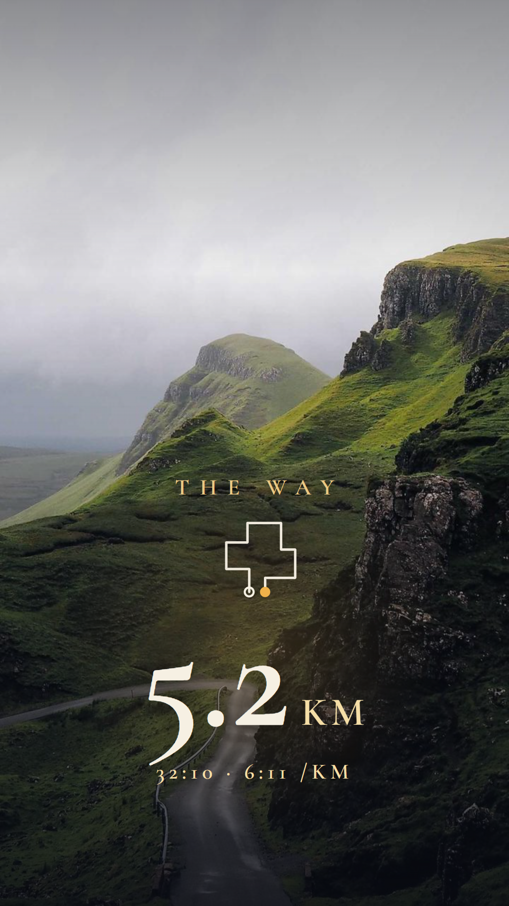
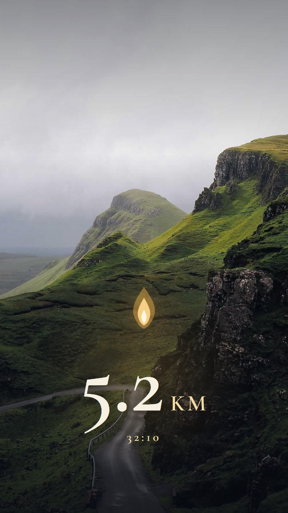
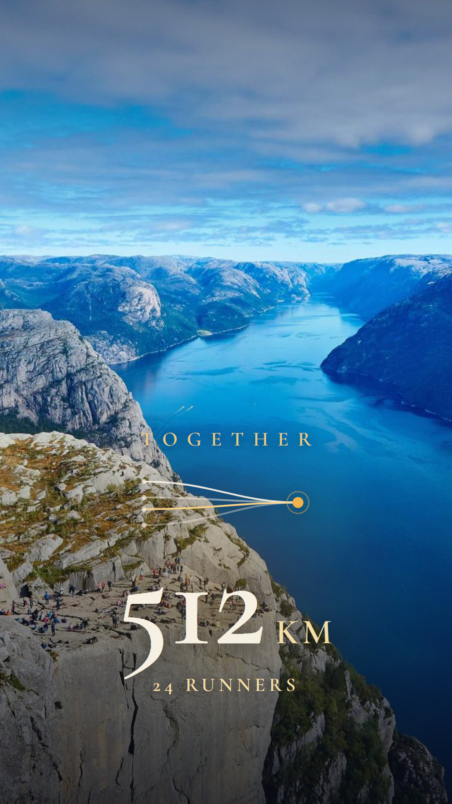

# 소셜 공유 카드 — PROJECT THE WAY

> 2026-07-21 · 인스타·스레드 "인증" 공유 기능 기획. Nike Run Club·Strava처럼 자랑하고 싶게, 단 우리답게.
> 렌더 시안은 아래 갤러리 · 에셋 [`docs/assets/share/`](assets/share). 관련: [[GROWTH]](유통 루프), [[CONTENT-UX]](톤), [[ART-DIRECTION]].

---

## 시안 (실제 사진 위 · 글로벌)

글자 최소 — **숫자·기호·최소 영문**으로 언어 장벽 없이. 우아한 세리프(Cormorant Garamond) + 금빛 + 따뜻한 빛, 실제 사진 위. 스티커는 배경 투명(`assets/stickers/`)이라 사용자가 **자기 사진** 위에 얹음. 아래는 샘플 사진 위 미리보기. 루트는 **내가 실제 뛴 GPS 경로**.

<table>
<tr>
<td align="center" width="33%"> <b>THE RUN</b> 실제 GPS 경로 + 거리</td>
<td align="center" width="33%"> <b>JOURNEY</b> ⭐ 순례 진척 08 / 12</td>
<td align="center" width="33%"> <b>STATION</b> 순례 인장 · VIII</td>
</tr>
<tr>
<td align="center"> <b>LAMP</b> 빛의 불꽃</td>
<td align="center"> <b>SEASON</b> 시즌 완주 · IV</td>
<td align="center"> <b>TOGETHER</b> 함께 · 512 KM</td>
</tr>
</table>

---

## 0. 왜 하는가

공유 카드는 [[GROWTH]]에서 말한 **"퍼뜨리는 게 즐거운 유통 루프"**의 핵심 도구다. Peloton은 출시 초기 8.9만 명이 50만+ 스토리를 만들며 소셜 공유가 강력한 성장 채널임을 증명했다. 우리도 **완주 직후 감정이 고조된 순간**에 원탭으로 아름다운 카드를 만들 수 있어야 한다.

---

## 1. 경쟁사 요약

| 앱 | 방식 | 강점 (빌릴 것) | 약점 (피할 것) |
|---|---|---|---|
| **Strava** | 사진 위 스탯 오버레이, Stats Sticker(투명 PNG), Flyover | 경로 라인 드로잉, 스탯의 사회적 증명 | 최근 리디자인 반발 — 지도 축소·가로사진 뭉개짐·9:16 강제 크롭·**"광고처럼"** 과밀 |
| **Nike Run Club** | "Share your run" 스티커·사진 커스터마이즈 | **감각적 스티커/타이포 + confetti·햅틱 + 원탭.** 데이터가 아니라 "분위기"를 팖 | — (톤 레퍼런스 1순위) |
| **Apple Fitness** | 링·어워드 그래픽만(지도 없음) | **위치 미노출 = 프라이버시 자동 보호** | 수치 공유 약함 |
| **Garmin** (2026) | 투명 오버레이 + **1:1/4:5/9:16 다중 비율** | 투명 오버레이로 사진 살림, 사용자 원본 비율 존중 | 프라이버시 은닉 옵션 부재 |
| **Gentler Streak** | 심미적 공유 시트, "친절·비경쟁" 브랜딩 | **설교/경쟁 없는 부드러운 정서** | — |

**핵심 프라이버시 교훈:** Strava의 원형 프라이버시 존조차 KU Leuven 연구에서 **85% 역추적** 가능했다. → 원형 크롭만으로 안전하지 않다. 시작/끝 구간 자체를 잘라내거나, 아예 실지도를 안 쓰는 게 답.

---

## 2. 빌릴 것 vs 피할 것

**빌릴 것**
- NRC의 감각적 스티커·타이포 + 완주 직후 축하 + **원탭 공유**.
- Apple식 **"위치 없는 성취 그래픽"을 기본값**으로.
- Garmin식 **투명 오버레이 + 다중 비율(1:1/4:5/9:16)**, 사용자 사진 비율 존중.
- 경로는 **라인 아트**로, 단 시작/끝점 은닉.
- Gentler Streak의 **비경쟁·친절** 정서.

**피할 것**
- 지도 축소·가로사진 뭉개기·9:16 강제 크롭·텍스트 과밀.
- 과도한 브랜딩/워터마크(광고처럼).
- 제네릭 템플릿 몰개성(모두 똑같은 카드).
- 위치 노출(시작/끝점·좌표·정밀 지도).
- **강제된 종교 문구·설교조** — 신앙 요소는 옵트인·서브틀하게.

---

## 3. 루트 라인 = 내가 뛴 실제 GPS 경로 (지도는 없이)

루트 라인은 **사용자가 실제로 뛴 GPS 경로의 모양**이다 — 그래서 GPS가 필요하고, 매번 다르고, "내가 뛴 것"이라는 진정성이 산다(Nike·Strava 카드의 힘). Strava·Garmin도 실제 경로를 선으로 그린다.

**단, 지도(동네 배경)는 얹지 않는다.** 좌표·지도 없이 **경로의 선 모양만** 떠 있으면 위치 특정이 훨씬 어렵다. 여기에:
- **시작/끝점 트리밍** — 집·직장이 드러나는 시작·끝 구간을 잘라낸다(원형 크롭만으론 부족 — Strava 85% 역추적 전례).
- **지명은 순례 자리 단위로만** — "갈릴리 호숫가"(에피소드 자리)이지 실제 동네명이 아니다.
- **지도 대신 루트 모양 + 거리 + 시간**만.

→ 실제 경로의 개인성은 살리되, 지도가 없어 위치 유출은 최소화. (도메인의 `RouteTrace` + 트리밍 렌더)

**참고 — 두 개의 "선"은 다르다:** 공유 스티커의 루트 = *오늘 내가 뛴 실제 경로*. 앱 안의 **여정 맵(THE LINE)** = *예수 공생애를 그린 일러스트 순례길*(진행 표시용). 둘은 별개다.

---

## 4. 카드 4종

> **기본형(base) = 사진 위에 얹는 최소 투명 오버레이** (2026-07-21 방향). 색 없이 흰 텍스트 + 얇은 선 + 하단 스크림만, **배경(누끼) 없음** — 사용자의 기존 사진과 그대로 결합. 아래 변형·요소(순례 라인, 성구, 품은 사람 등)는 그 위에 **옵션으로 얹는다.** 데이터는 거리·시간·자리 정도로 최소.

### ① 순례 카드 (Pilgrimage) — 기본값, 위치 없음
THE LINE + 오늘 닿은 자리 + 최소 스탯 + 얼굴 없는 실루엣 장면. 성구는 **옵트인 토글**(끄면 순수하게 예쁜 러닝 카드 → 비신자도 공유 OK).
- 예: `갈릴리 호숫가 · 8번째 자리` / `5.2 km · 32:10` / (옵션) *"빛이 어둠에 비치되"*

### ② 사진 오버레이 카드 (Photo Overlay)
사용자 본인 사진(새벽 러닝 등) 위에 **투명 오버레이** — 최소 스탯 2개 + 작은 라인 아트 조각(실좌표 아님) + 작은 워드마크. 하단 스크림 그라디언트로 어떤 배경에서도 가독성. 세이프존 준수.

### ③ 품은 사람 카드 (Intercession) — 우리만의 훅
`오늘 ○○를 품고 5.2km를 달렸어요.` 따뜻하고 인간적. 비-설교적이고, 그 사람에게 자연스러운 초대가 된다([[GROWTH]] 유통 루프 ③). **기도 대상 이름은 이니셜/별칭만**(프라이버시).

### ④ 톤 인지 — 안식·애통엔 flex가 없다
수난(lament) 콘텐츠나 안식일엔 **스탯·축하 없는** 카드만: `오늘은 세지 않습니다. 다만 이 길을 함께 걸었습니다.` 십자가를 자랑거리로 만들지 않는다([[CONTENT-UX]] `mood`). 이 절제가 오히려 품격.

---

## 5. 포맷·규격 (2025–2026)

| 포맷 | 크기 | 비고 |
|---|---|---|
| **IG/스레드 스토리·릴스** | 1080×1920 (9:16) | 상·하 ~220–250px는 UI에 가려짐 → 핵심은 **중앙 세이프존 1080×1420** 안에 |
| **피드(세로)** | 1080×1350 (4:5) | 화면 점유율 최고 |
| **정사각** | 1080×1080 (1:1) | |

- **가로 사진 강제 크롭 금지** — 사용자 원본 비율 존중, 다중 비율 제공.

---

## 6. 프라이버시 가드레일 (최우선)

- **루트는 실제 경로 모양만, 지도(동네 배경)·좌표는 얹지 않는다.**
- **시작/끝 구간 트리밍**(원형 크롭 불충분), 지명은 순례 자리 단위로만(실 동네명 금지).
- **기도 내용·대상은 절대 자동 포함 안 함.** 품은 사람 카드도 이름은 이니셜/별칭, 명시적 동의 시에만.
- 공유는 언제나 사용자가 미리보기 후 선택. 자동 게시 없음.

---

## 7. 무신론자 친화 (복음은 유지, 강요는 없이)

- **성구·기도 요소는 옵트인.** 끄면 순수하게 아름다운 순례 러닝 카드.
- 켜도 **은은하게**(작은 세리프 한 줄), 설교조 금지.
- 카드가 그 자체로 예뻐서(Nike-clean) 신앙 여부와 무관하게 flex가 된다 → 비신자 친구가 공유받아도 불편하지 않고, 오히려 "이거 뭐야 예쁘다"로 유입([[GROWTH]] 온램프).

---

## 8. 원탭 플로우

완주 → THE REVEAL → **[공유]** → 자동 생성 카드 미리보기 → (선택) 사진 교체 · 카드 종류 · 성구 토글 · 비율 → 채널 선택. **편집 강요 없음.**

---

## 9. MVP 범위

- **포함:** 순례 카드(기본·위치 없음) + 품은 사람 카드 / 스토리(9:16)·피드(4:5) / 성구 토글 / 톤 인지(수난=flex 없음).
- **나중:** 사진 오버레이, 마일스톤 뱃지 카드, 애니메이션/영상 카드, 다중 비율 전체.

---

## 10. 엔지니어링 훅

- **`ShareCard`** 컴포넌트 — `variant`(pilgrimage·photo·intercession·rest) × `mood`([[CONTENT-UX]]) × `format`(story·feed·square)를 받아 렌더 → 캔버스/SVG로 PNG export.
- **mood-aware:** `mood==='lament'`이면 스탯·축하 요소를 끄고 rest 변형만 허용(Zod refine과 동일 원칙).
- **위치 안전:** ShareCard는 `RouteTrace`의 경로 모양을 쓰되 **지도 없이 선만**, 시작/끝 구간을 트리밍하고 좌표·동네 지명을 제거한다. 기도 대상은 별칭만.
